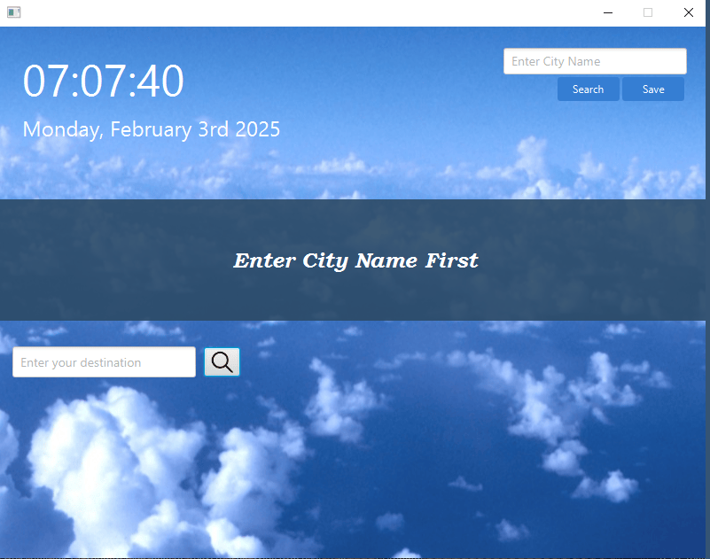

# WeatherApp

Aplikacja wyświetlająca pogodę na najbliższe 6 dni

Aplikacja stworzona w języku Java, wykorzystująca JavaFX do budowy interfejsu użytkownika oraz zarządzana i budowana przy użyciu Maven., została stworzona z myślą o szybkim i wygodnym dostępie do aktualnych danych meteorologicznych. Program prezentuje bieżącą pogodę oraz prognozę maksymalnej temperatury na najbliższe 6 dni, dzięki czemu użytkownik może zaplanować swój dzień lub nadchodzące wydarzenia.

Unikalną funkcjonalnością aplikacji jest możliwość wyświetlania prognoz dla dwóch odrębnych miast jednocześnie, co umożliwia łatwe porównanie warunków atmosferycznych w różnych lokalizacjach. Dzięki temu rozwiązaniu użytkownicy mogą podejmować lepiej przemyślane decyzje, czy to planując podróż, czy wybierając miejsce do zamieszkania lub pracy.

## Wykorzystane technologie
**Java, JavaFX, Maven**

 

