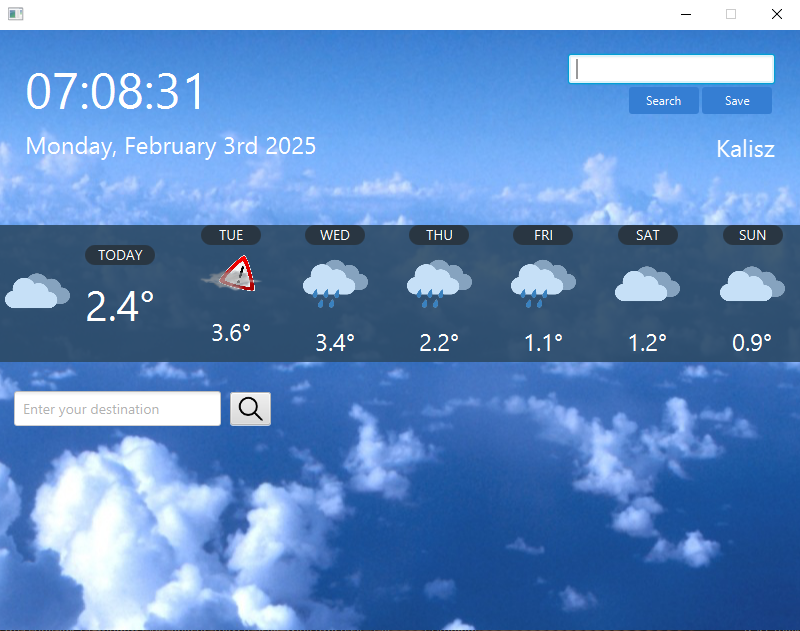
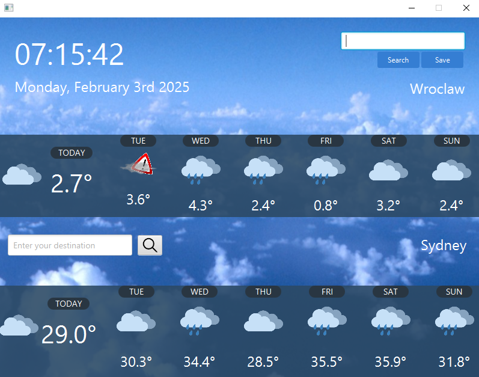

# WeatherApp

Aplikacja wyświetlająca pogodę na najbliższe 6 dni

This application is built in Java using JavaFX for the graphical user interface and Maven for project management. It provides fast and convenient access to current meteorological data. The program shows the current weather conditions along with the maximum temperature forecast for the next six days, helping users plan their day or upcoming events.

## Technologies used

**Java, JavaFX, Maven**

 

 

A key feature of the application is the ability to display forecasts for two different cities at the same time, making it easy to compare weather conditions between locations. This can be particularly useful when planning trips or evaluating where to live or work.

  

